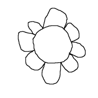
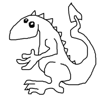
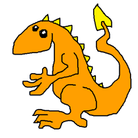
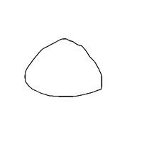
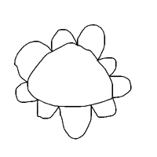
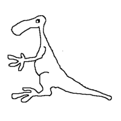
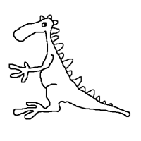

# codeSample 
### PythonPaint Augmentations

##### Code sample:
Augmentations.py is part of the code for a machine learning training set augmentation generator for DragonPaint (automated drawing and coloring of cartoon characters) and related projects.

The augmentation goal is to leverage extremely small original data sets (e.g. 30 drawings, only one colored, for B&W sketch to color) to get to the estimated 400-1000 training pairs we need to follow Isola, et. al.'s GANs image to image translation work. 

##### DragonPaint: 
DragonPaint uses geometric rules and other augmentations to leverage extremely small original data sets to create augmented training set generation for automating coloring and drawing with machine learning. 

##### DragonPaint - B&W Sketch to Color:
Presented at the PAPIs machine learning conference in October, 2017 and at Boston Python in December, 2018, the first DragonPaint project trained a GANs model to color cartoon characters of two character types, dragons and flowers, in a consistent way across type by combining geometric rules, rule breaking transformations and machine learning. 

We used geometric rules to create the colored version in AB sketch/colored pairs for 30-40 original "rule conforming" drawings of each type (background = largest component = white, body/center = next largest = orange...) After using components and rule conforming drawings to create AB pairs, we created "rule breaking" drawings with colored mates to add to the training set by applying rule breaking transformations AB -> A'B' or AB -> A'B. Examples include erasing parts of lines in an A drawing and pairing it with the colored version B generated before the erasing, or cropping/rescaling A and B so they broke the rule that the background must be bigger than the body. 

Having created augmented training sets in the 400-1000 range, we applied Isola, et. al's GANs image to image translation work and Hesse's TensorFlow implementation to successfully color flowers and dragons with the trained model, including several types that the geometric rules could not (e.g. drawings with poorly connected lines or flowers with small centers.)

##### DragonPaint - Layers of Complexity/Spikify:
The second DragonPaint project will investigate the stages of complexity in the creation of a drawing and see whether we can train the same AB image to image translation model to draw petals and spikes by using temporal information and saving drawings in stages (e.g. draw the center, save the drawing as an A, add the petals to that center, save it as the paired B.)

##### DragonPaint Presentations
PAPIs ML conference talk, October, 2017  
Boston Python meetup, December, 2017  
[PAPIs slides](https://drive.google.com/open?id=1XtB26GEqcZI-nPldiM92hiByG1SH0-X1)

##### Resources
[*Image to Image Translation with Conditional Adversarial Networks*](https://arxiv.org/abs/1611.07004), Isola, et. al.
  TensorFlow Pix2Pix [implementation](https://github.com/affinelayer/pix2pix-tensorflow) by Christopher Hesse  
[*Best Practices for Convolutional Neural Networks Applied to Visual Document Analysis*](https://www.microsoft.com/en-us/research/publication/best-practices-for-convolutional-neural-networks-applied-to-visual-document-analysis/), Simard, et. al.

##### Contact
[K. G. Greene Linked In](https://www.linkedin.com/in/kgretchengreene/)
